# MonopolyBattle — 7-Day Development Roadmap

> **Developer:** 1 developer + AI assistance
> **Total Estimated Hours:** ~56h (8h/day × 7 days)
> **Start Date:** Day 1 (when you begin coding)
> **Methodology:** Ship working software every day. Ruthless scope control.

---

## Roadmap Overview

```mermaid
gantt
    title MonopolyBattle — 7-Day Roadmap
    dateFormat  D
    axisFormat  Day %d

    section Day 1 — Foundation
    Project scaffolding          :done, d1a, 1, 2h
    Backend bootstrap            :done, d1b, after d1a, 2h
    Database + migrations        :done, d1c, after d1b, 2h
    Auth endpoints               :done, d1d, after d1c, 2h

    section Day 2 — Real-time Core
    Socket.IO server setup       :done, d2a, 2, 1h
    Connection + room handlers   :done, d2b, after d2a, 2h
    Game engine core loop        :done, d2c, after d2b, 3h
    Decision engine              :done, d2d, after d2c, 2h

    section Day 3 — Game Logic
    Event engine                 :done, d3a, 3, 2h
    Monopoly detector            :done, d3b, after d3a, 1h
    Scoring engine               :done, d3c, after d3b, 2h
    Narrator template system     :done, d3d, after d3c, 3h

    section Day 4 — Frontend Core
    Next.js setup + design sys   :done, d4a, 4, 2h
    Landing + Join + Host pages  :done, d4b, after d4a, 3h
    Game page + Zustand stores   :done, d4c, after d4b, 3h

    section Day 5 — Game UI
    Decision panel + Timer       :d5a, 5, 2h
    Event overlay + Narrator box :d5b, after d5a, 2h
    Market chart + Team stats    :d5c, after d5b, 2h
    Quiz UI                      :d5d, after d5c, 2h

    section Day 6 — Integration
    Quiz engine + socket wiring  :d6a, 6, 3h
    Projector view               :d6b, after d6a, 2h
    Host control panel           :d6c, after d6b, 2h
    End-to-end test run          :d6d, after d6c, 1h

    section Day 7 — Polish + Deploy
    Bug fixes + edge cases       :d7a, 7, 2h
    Educational content          :d7b, after d7a, 2h
    Animations + visual polish   :d7c, after d7b, 2h
    Deployment VPS               :d7d, after d7c, 2h
```



---

## MVP Definition

> The MVP is the **minimum playable game** that teaches the educational content.
> A game session must be completable from start to finish without crashing.

### MVP — Must Ship (Days 1–6)

| Feature | Rationale |
|---|---|
| Host creates game, teams join | Game cannot start without this |
| 9 teams, lobby with ready state | Core multiplayer requirement |
| 8 rounds with 60s decision timer | Core gameplay loop |
| 4–6 decisions per round | Core strategic choice |
| Decision effects on team stats | Game mechanics must work |
| 3 random events per game | Adds unpredictability |
| Monopoly detection + narration | Core educational moment |
| 3 quiz questions (rounds 3, 5, 7) | Educational requirement |
| Template-based AI narrator | Educational commentary |
| Final leaderboard (top 3) | Game conclusion |
| Projector display | Classroom requirement |
| Socket.IO real-time sync | Core technology |

### Optional — Ship if Time Allows (Day 7)

| Feature | Value | Effort |
|---|---|---|
| Framer Motion animations | High UX polish | Medium |
| QR code on projector | Convenience | Low |
| Animated market share chart | Visual impact | Medium |
| Host manual event trigger | Teacher control | Low |
| Reconnection handling | Robustness | Medium |
| Decision quality scoring bonus | Deeper mechanics | Low |
| Speed bonus on quiz answers | Engagement | Low |
| Sound effects | Immersion | High |
| Full HTTPS + Let's Encrypt | Production | Medium |

---

## Day-by-Day Breakdown

---

### Day 1 — Foundation & Backend Bootstrap

**Goal:** Server runs, DB works, auth endpoints respond.
**Hours:** 8h | **Commits target:** 4–6

```
08:00 – 10:00  Task 1: Project Scaffolding (2h)
10:00 – 12:00  Task 2: Backend Bootstrap (2h)
13:00 – 15:00  Task 3: Database Schema + Migrations (2h)
15:00 – 17:00  Task 4: Auth Endpoints (2h)
```

#### Task 1 — Project Scaffolding `2h` `Critical`

**Goal:** Mono-repo structure created, all packages initialized.

- [x] Create client/, server/, shared/ workspace structure
- [x] Initialize root package.json with npm workspaces
- [x] Install server core deps: express socket.io better-sqlite3 jsonwebtoken cors helmet express-rate-limit pino uuid seedrandom
- [x] Install server dev deps: typescript ts-node nodemon @types/*
- [x] Configure server/tsconfig.json (strict mode)
- [x] Run: npx create-next-app@latest client/ --typescript --tailwind --app --eslint
- [x] Install client deps: zustand framer-motion socket.io-client
- [x] Install shadcn/ui and add components: button card dialog badge progress toast
- [x] Configure shared/ package with shared types
- [x] Verify npm run dev works in both client/ and server/

**Deliverable:** Both dev servers start without errors

---

#### Task 2 — Backend Bootstrap `2h` `Critical`

**Goal:** Express server with all middleware configured.

- [x] Create server/src/index.ts — Express + Socket.IO bootstrap
- [x] Configure middleware: cors, helmet, express-rate-limit
- [x] Create server/src/config/index.ts — env var loading with validation
- [x] Create server/src/config/database.ts — SQLite init with WAL + pragmas
- [x] Create server/src/utils/logger.ts — pino logger
- [x] Create server/src/utils/room-code.ts — 6-char code generator
- [x] Create server/src/utils/random.ts — seeded RNG wrapper
- [x] Create server/src/middleware/auth.middleware.ts — JWT validation
- [x] Create server/src/middleware/error.middleware.ts — global error handler
- [x] Health check: GET /api/health returns { status: 'ok' }

**Deliverable:** curl http://localhost:4000/api/health returns 200

---

#### Task 3 — Database Schema + Migrations `2h` `Critical`

**Goal:** All 7 tables created with indexes and relationships.

- [x] Create server/migrations/001_initial.sql with full schema
- [x] Tables: game, team, player, round, decision_log, round_event, quiz_answer
- [x] Create all indexes from architecture section 4.2
- [x] Create server/src/repositories/ with one repo per table
- [x] Each repository exposes: findById, create, update, findMany
- [x] Run migrations automatically on server startup
- [x] Create scripts/seed-db.ts for dev testing

**Deliverable:** DB file created, all tables present, seed data insertable

---

#### Task 4 — Auth Endpoints `2h` `Critical`

**Goal:** Host and player can authenticate and get tokens.

- [x] Create shared/types/: game.types.ts, team.types.ts, quiz.types.ts, socket-events.ts
- [x] Create server/src/controllers/auth.controller.ts:
  - POST /api/auth/host — verify PIN, return host JWT
  - POST /api/auth/join — verify room code, create player + team, return JWT
- [x] Create server/src/controllers/game.controller.ts:
  - POST /api/games — host creates game, returns room code
  - GET /api/games/:id — get game state
- [x] Create server/src/services/game.service.ts
- [x] Create server/src/services/team.service.ts
- [x] Test all endpoints

**Deliverable:** Host authenticates; player joins with room code; JWT returned

---

### Day 2 — Real-time Core & Game Engine (Part 1)

**Goal:** Socket.IO works end-to-end; game engine processes one round.
**Hours:** 8h | **Commits target:** 5–7

```
08:00 – 09:00  Task 5: Socket.IO Server Setup (1h)
09:00 – 11:00  Task 6: Connection + Room Handlers (2h)
11:00 – 14:00  Task 7: Game Engine Core Loop (3h)
14:00 – 16:00  Task 8: Decision Engine (2h)
```

#### Task 5 — Socket.IO Server Setup `1h` `Critical`

- [x] Create server/src/socket/index.ts — Socket.IO server with JWT auth middleware
- [x] Extract + verify JWT from socket.handshake.auth.token
- [x] Attach role, gameId, teamId to socket.data
- [x] Sockets join room:{gameId} and team:{teamId}
- [x] Create typed socket emit wrapper

**Deliverable:** Socket.IO server starts; client connects with token

---

#### Task 6 — Connection & Room Handlers `2h` `Critical`

- [x] Create server/src/socket/connection.handler.ts:
  - connect: join rooms, update player socket_id, broadcast team:joined
  - disconnect: mark disconnected, start 30s grace timer
  - player:ready: mark team ready, broadcast team:ready
  - projector:join: join projector room (read-only)
- [x] Create server/src/socket/host-event.handler.ts:
  - host:start-game: validate 2+ ready teams, emit game:countdown
  - host:pause / host:resume: toggle pause state
  - host:next-phase: manual phase advance
- [x] Implement 5-second countdown then start round 1
- [x] Broadcast game:phase-change on every transition

**Deliverable:** Teams join lobby; host starts game; countdown works

---

#### Task 7 — Game Engine Core Loop `3h` `Critical`

> This is the most critical task. Get this right before moving on.

- [x] Create server/src/engine/game.engine.ts:
  - Holds ServerGameState in memory (single source of truth)
  - startRound(roundNumber): generates decisions, starts timer
  - processRound(): collects decisions, applies effects, saves to DB
  - advancePhase(): state machine transitions
  - getPublicState(): sanitized state for broadcast
  - getTeamState(teamId): private state per team
- [x] ServerGameState fields: gameId, phase, currentRound, teams Map, availableDecisions, submittedDecisions Map, currentEvent, roundTimer, seed
- [x] Round timer: 60s countdown, emit round:tick every 5s, auto-process on expiry or all-submitted
- [x] Save round to round table
- [x] Emit round:start to all sockets

**Deliverable:** A round starts, times out, and processes in sequence

---

#### Task 8 — Decision Engine `2h` `Critical`

- [x] Create server/src/engine/decision.engine.ts:
  - getAvailableDecisions(round, teamState): returns 4–6 decisions (seeded RNG)
  - applyDecision(team, decision, context): returns StatsDelta
  - Internal effectsTable matching architecture section 7.2
- [x] Implement all 9 decision types with base effects + diminishing returns modifiers
- [x] Filter decisions by team state (money, market share thresholds)
- [x] Handle player:decision socket event: validate, store, ack, check early-process trigger
- [x] Save decision_log record per submission

**Deliverable:** Teams submit decisions; effects calculated correctly

---

### Day 3 — Game Logic Completion

**Goal:** Full game loop works with events, scoring, and narration.
**Hours:** 8h | **Commits target:** 4–6

```
08:00 – 10:00  Task 9:  Event Engine (2h)
10:00 – 11:00  Task 10: Monopoly Detector (1h)
11:00 – 13:00  Task 11: Scoring Engine (2h)
13:00 – 16:00  Task 12: Narrator Template System (3h)
```

#### Task 9 — Event Engine `2h` `Critical`

- [x] Create server/src/engine/event.engine.ts:
  - maybeGenerateEvent(round, rng): 60% chance, returns GameEvent or null
  - applyEvent(event, teams): returns per-team deltas
  - Internal eventPool[] with all 9 event types (architecture section 7.4)
- [x] Implement event target selection (all teams vs. specific teams)
- [x] Save round_event record to DB
- [x] Emit event:triggered to all sockets
- [x] Integrate into GameEngine.processRound()

**Deliverable:** Random events fire 60% of rounds with correct effects

---

#### Task 10 — Monopoly Detector `1h` `Critical`

- [x] Create server/src/engine/monopoly-detector.ts:
  - check(teams): returns MonopolyResult or null
  - All 4 monopoly conditions from architecture section 7.5
- [x] On detection: emit monopoly:detected, apply government intervention, boost other teams
- [x] Integrate into GameEngine.processRound() (runs after decisions + events)

**Deliverable:** Monopoly condition triggers intervention and notification

---

#### Task 11 — Scoring Engine `2h` `Critical`

- [x] Create server/src/engine/scoring.engine.ts:
  - calculateRoundScore(team, decision, context): number
  - calculateQuizScore(correct, timeTakenMs, timeLimit): number
  - getFinalRanking(teams): sorted RankedTeam[]
  - getLeaderboard(teams): public leaderboard array
- [x] Business Score + Decision Quality Score formulas (architecture section 7.6)
- [x] Create server/src/services/score.service.ts
- [x] Emit round:results with per-team deltas
- [x] Emit team:stats-update privately per team socket room

**Deliverable:** Scores calculated correctly; leaderboard updates each round

---

#### Task 12 — Narrator Template System `3h` `Critical`

- [x] Create template JSON files in server/src/narrator/templates/:
  - decisions.json — 3–4 Vietnamese variants per decision type
  - events.json — 2–3 variants per event
  - monopoly.json — 4 variants with educational explanation
  - education.json — concept explanations
  - round-summary.json — 5 summary variants
- [x] Create server/src/narrator/template.system.ts:
  - Load all JSON at startup into memory
  - selectTemplate(category, conditions): condition-filtered selection
  - Track last 2 used IDs per category to avoid repetition
- [x] Create server/src/narrator/narrator.engine.ts:
  - generate(trigger, context): NarrationResult
  - buildContext(gameState, teamState): variable map
  - injectVariables(template, context): final string with {teamName}, {marketShare} etc.
- [x] Integrate into GameEngine.processRound()
- [x] Emit narrator:message after each round

**Deliverable:** Narration generated after every decision, event, and monopoly detection

---

### Day 4 — Frontend Core

**Goal:** Next.js app with design system, routing, and Zustand stores working.
**Hours:** 8h | **Commits target:** 4–6

```
08:00 – 10:00  Task 13: Design System + Global Styles (2h)
10:00 – 13:00  Task 14: Landing + Join + Host Pages (3h)
13:00 – 16:00  Task 15: Game Page + Zustand Stores (3h)
```

#### Task 13 — Design System + Global Styles `2h` `Important`

- [x] Configure tailwind.config.ts: deep navy primary, electric gold accent, crimson danger, emerald success, dark slate background
- [x] Set up Google Fonts (Inter) in app/layout.tsx
- [x] Create app/globals.css: CSS custom properties, dark mode base, scrollbar styling
- [x] Configure shadcn/ui theme colors to match palette
- [x] Create components/layout/game-layout.tsx — shared page wrapper
- [x] Create components/layout/game-header.tsx — logo + round indicator + timer slot

**Deliverable:** Consistent, polished visual design system ready to use

---

#### Task 14 — Landing + Join + Host Pages `3h` `Critical`

- [x] Create app/page.tsx — landing with two CTAs: "Vào game" + "Tạo game"
- [x] Create app/play/join/page.tsx — room code + team name + player name form → POST /api/auth/join → save token → redirect
- [x] Create app/host/page.tsx — host PIN + game config (rounds, duration) → POST /api/auth/host → POST /api/games → redirect
- [x] Create app/play/lobby/page.tsx — teams list + ready status + "Ready" button
- [x] Create app/host/lobby/page.tsx — room code display + team list + "Start Game" button
- [x] Create lib/api.ts — typed fetch wrapper for REST calls
- [x] Create lib/socket.ts — Socket.IO client singleton

**Deliverable:** Teams join; host creates game; lobby visible to all

---

#### Task 15 — Game Page + Zustand Stores `3h` `Critical`

- [x] Create stores/game.store.ts — full ClientGameState + all actions
- [x] Create stores/socket.store.ts — connection state + socket ref
- [x] Create stores/ui.store.ts — modal/overlay/toast visibility flags
- [x] Create hooks/use-socket.ts — initializes socket, registers all event handlers, cleans up on unmount
- [x] Create hooks/use-game-state.ts — selector hooks for common slices
- [x] Create hooks/use-countdown.ts — setInterval countdown hook
- [x] Create app/play/game/page.tsx shell — phase-based view rendering driven by gameStore.phase
- [x] Register all Socket.IO event handlers: round:start, round:results, event:triggered, narrator:message, quiz:start, game:over

**Deliverable:** Game page renders, socket connected, stores update on events

---

### Day 5 — Game UI Components

**Goal:** All visual game components built and connected to store.
**Hours:** 8h | **Commits target:** 5–7

```
08:00 – 10:00  Task 16: Decision Panel + Timer (2h)
10:00 – 12:00  Task 17: Event Overlay + Narrator Box (2h)
12:00 – 14:00  Task 18: Market Chart + Team Stats (2h)
14:00 – 16:00  Task 19: Quiz UI (2h)
```

#### Task 16 — Decision Panel + Timer `2h` `Critical`

- [ ] Create components/game/decision-card.tsx — icon, Vietnamese title, description, hover/selected/disabled states, cost-benefit preview row
- [ ] Create components/game/decision-panel.tsx — grid of 4–6 cards, single-select, submit button, "Waiting..." state with team submission count
- [ ] Create components/game/round-timer.tsx — circular countdown, green to yellow (30s) to red (10s), pulsing animation at less than 10s

**Deliverable:** Player sees decisions, selects one, submits within 60s

---

#### Task 17 — Event Overlay + Narrator Box `2h` `Critical`

- [ ] Create components/game/event-overlay.tsx — full-screen blur backdrop, event card with icon/title/description/effect summary, auto-dismiss after 5s
- [ ] Create components/game/narrator-box.tsx — slide-up panel, avatar icon, typewriter text animation, color-coded border (info/warning/education), related concept badge, auto-dismiss after 6s
- [ ] Wire both to ui.store.ts visibility flags
- [ ] Test overlay + narrator appear and disappear correctly

**Deliverable:** Event overlay and narrator box display and dismiss correctly

---

#### Task 18 — Market Chart + Team Stats `2h` `Important`

- [ ] Create components/game/team-stats.tsx — 5 stat bars (Money, Market Share, Tech, Reputation, Monopoly Risk), animated number transitions, color thresholds
- [ ] Create components/game/market-share-chart.tsx — horizontal stacked bar chart with CSS, color-coded per team, animates on update, team labels + percentages
- [ ] Create components/game/leaderboard.tsx — ranked list, rank change arrows, highlighted "your team" row
- [ ] Integrate into game page sidebar

**Deliverable:** Stats and market chart visible and animated during rounds

---

#### Task 19 — Quiz UI `2h` `Critical`

- [ ] Create components/quiz/quiz-modal.tsx — modal backdrop, 30s timer bar, question text, 4 answer buttons
- [ ] Create components/quiz/answer-options.tsx — 2x2 grid, keyboard shortcuts A/B/C/D, lock on answer, emit player:quiz-answer
- [ ] Create components/quiz/quiz-result.tsx — highlight correct (green) / wrong (red), show explanation + points per team, auto-advance after 8s
- [ ] Create components/quiz/question-card.tsx — Vietnamese text formatting, category badge
- [ ] Register quiz:start and quiz:results socket events in use-socket.ts

**Deliverable:** Quiz appears, player answers, result shown with explanation

---

### Day 6 — Integration + Host & Projector

**Goal:** Complete end-to-end game flow from lobby to leaderboard.
**Hours:** 8h | **Commits target:** 4–6

```
08:00 – 11:00  Task 20: Quiz Engine (Backend) + Socket Wiring (3h)
11:00 – 13:00  Task 21: Projector View (2h)
13:00 – 15:00  Task 22: Host Control Panel (2h)
15:00 – 16:00  Task 23: End-to-End Test Run (1h)
```

#### Task 20 — Quiz Engine (Backend) + Full Socket Wiring `3h` `Critical`

- [ ] Create server/src/education/data/quizzes.json — 15 questions (5 each: monopoly definition, state monopoly, Vietnam electricity/water context)
- [ ] Create server/src/education/quiz.engine.ts: getQuizForRound(round), scoreAnswer(), generateQuizResult()
- [ ] Integrate quiz into GameEngine: fire on rounds 3, 5, 7; collect answers for 30s; emit quiz:results; save quiz_answer records
- [ ] Create server/src/education/education.engine.ts — concept mapper
- [ ] Wire remaining socket events: player:quiz-answer, host:trigger-event
- [ ] Implement game:over: final rankings, emit to all, update DB status
- [ ] Create GET /api/games/:id/results endpoint

**Deliverable:** Full game cycle: lobby → rounds → quizzes → game over

---

#### Task 21 — Projector View `2h` `Important`

- [ ] Create app/projector/page.tsx — room code entry, connects as projector role, large-font TV layout
- [ ] Phase-aware views: Lobby (QR code + team list), Decision (submission count + timer), Event (full-screen card), Narration (large text), Quiz (display only), Results (leaderboard), Game Over (top 3 podium)
- [ ] Create components/projector/projector-board.tsx, narration-display.tsx, market-overview.tsx
- [ ] Add QR code using qrcode.react library
- [ ] Test on large screen or browser at 150% zoom

**Deliverable:** Projector page shows correct content for every phase

---

#### Task 22 — Host Control Panel `2h` `Important`

- [ ] Create app/host/control/page.tsx — phase indicator, team submission status, round controls
- [ ] Buttons: Pause, Force Next Phase, End Game
- [ ] Create components/host/host-control-panel.tsx, team-list.tsx, round-controller.tsx
- [ ] Create app/results/page.tsx — fetches final results, top 3 podium, educational concept summary

**Deliverable:** Host monitors and controls game; results page shows final outcome

---

#### Task 23 — End-to-End Test Run `1h` `Critical`

> Open multiple browser tabs and simulate a complete game.

- [ ] Open 3 team tabs + 1 host tab + 1 projector tab
- [ ] Play through all 8 rounds manually
- [ ] Verify every phase transition works correctly
- [ ] Verify quiz appears on rounds 3, 5, 7
- [ ] Verify monopoly detection fires and intervention applies
- [ ] Verify game over and results page
- [ ] Log all bugs found for Day 7 fixes

**Deliverable:** Game completes start-to-finish without fatal errors

---

### Day 7 — Polish, Content & Deployment

**Goal:** Game is bug-free, polished, deployed, and ready to demo in the classroom.
**Hours:** 8h | **Commits target:** 4–6

```
08:00 – 10:00  Task 24: Bug Fixes + Edge Cases (2h)
10:00 – 12:00  Task 25: Educational Content Completion (2h)
12:00 – 14:00  Task 26: Animations + Visual Polish (2h)
14:00 – 16:00  Task 27: Deployment (2h)
```

#### Task 24 — Bug Fixes + Edge Cases `2h` `Critical`

- [ ] Fix all bugs logged in Task 23
- [ ] Handle team disconnect mid-game: skip their decision, remove from submissions count
- [ ] Handle host browser refresh: restore state from DB, re-attach to socket room
- [ ] Handle late joiners: reject if phase is not lobby, show friendly error
- [ ] Handle duplicate decision submission: server rejects second submission
- [ ] Handle quiz answer after timer expiry: server time-checks, score = 0
- [ ] Sanitize all user inputs: team names, player names
- [ ] Test with DevTools Slow 3G throttling

**Deliverable:** Game handles all common failure cases gracefully

---

#### Task 25 — Educational Content Completion `2h` `Important`

- [ ] Review all narrator templates: minimum 3 variants per category, accurate Vietnamese, correct economic concepts explained
- [ ] Complete all 15 quiz questions: plausible distractors, explanations referencing gameplay moments, difficulty increases by round
- [ ] Complete concepts.json with 5 key economic concepts
- [ ] Review decision and event descriptions for Vietnamese clarity
- [ ] Full quiz flow test: correct answer shown, explanation renders, concept badge visible

**Deliverable:** All educational content complete, accurate, and in Vietnamese

---

#### Task 26 — Animations + Visual Polish `2h` `Important`

> Skip any single animation taking more than 30 minutes.

- [ ] Decision card hover — lift + border glow effect (15min)
- [ ] Event overlay entrance — scale + fade backdrop (15min)
- [ ] Narrator box — slide-up entrance + typewriter text animation (20min)
- [ ] Round results stats — animated number counter (20min)
- [ ] Leaderboard — layout animation on rank changes (20min)
- [ ] Game Over top 3 — staggered entrance animation (20min)
- [ ] Round phase transitions — crossfade between views (10min)
- [ ] Timer urgency — red pulse animation at less than 10s (10min)
- [ ] Market chart bars — spring-based width transitions (15min)
- [ ] Verify no animation blocks or delays user interaction

**Deliverable:** Game feels alive and premium, not like a prototype

---

#### Task 27 — Deployment `2h` `Important`

- [ ] Create ecosystem.config.js with PM2 config for both frontend and backend processes
- [ ] Create .env.example with all required environment variables
- [ ] Create scripts/deploy.sh with git pull, build, and pm2 reload steps
- [ ] Provision DigitalOcean Droplet: 2GB RAM / 1 vCPU
- [ ] Install on server: Node.js 20 LTS, Nginx, PM2, certbot
- [ ] Clone repo to /var/www/monopoly/
- [ ] Configure Nginx reverse proxy per architecture section 11.2
- [ ] Set up SSL with certbot --nginx
- [ ] Initialize SQLite DB with migrations
- [ ] Start with PM2, run pm2 save and pm2 startup
- [ ] Smoke test: complete one full game via the public URL

**Deliverable:** Game accessible at public HTTPS URL

---

## Hour Summary

| Day | Focus | Hours |
|---|---|---|
| Day 1 | Foundation + Backend Bootstrap | 8h |
| Day 2 | Real-time Core + Game Engine pt.1 | 8h |
| Day 3 | Game Engine Completion + Narrator | 8h |
| Day 4 | Frontend Core + Design System | 8h |
| Day 5 | Game UI Components | 8h |
| Day 6 | Integration + Host + Projector | 8h |
| Day 7 | Polish + Content + Deploy | 8h |
| **Total** | | **56h** |

---

## Task Priority Legend

| Label | Meaning |
|---|---|
| Critical | MVP breaks without this |
| Important | Significant quality impact |
| Nice-to-have | Polish and extras only if time allows |

### Critical Path

```
Task 1 → Task 2 → Task 3 → Task 4
       → Task 5 → Task 6 → Task 7 → Task 8
       → Task 9 → Task 10 → Task 11 → Task 12
       → Task 13 → Task 14 → Task 15
       → Task 16 → Task 19
       → Task 20 → Task 23
```

If only the critical path is completed: roughly 40h of work. Game is functional but visually minimal.

---

## Risk Register

| Risk | Likelihood | Impact | Mitigation |
|---|---|---|---|
| Socket.IO sync bugs between clients | High | High | Test with 3+ tabs from Day 2 onwards |
| Game engine state corruption | Medium | Critical | Keep engine logic pure with no side effects |
| Decision timer desync | Medium | Medium | Server is authoritative; client timer is visual only |
| SQLite write contention | Low | Medium | WAL mode handles this at 18 users |
| Framer Motion perf on mobile | Low | Low | Use useReducedMotion hook |
| Deployment config errors | Medium | High | Test deploy on Day 6, not Day 7 |
| Vietnamese encoding issues | Low | Medium | UTF-8 everywhere; test with real Vietnamese text |
| PM2 process crash mid-game | Low | Critical | Set max_memory_restart and monitor PM2 logs |

---

## AI Assistance Tips

| Task | Prompt Strategy |
|---|---|
| Database schema | "Generate better-sqlite3 prepared statements for this schema" |
| Socket.IO handlers | "Write typed Socket.IO event handlers for this payload interface" |
| Decision effects table | "Turn this table into a TypeScript Map with the StatsDelta type" |
| Narrator templates | "Write 4 Vietnamese narration templates for the acquire-competitor decision explaining capital concentration" |
| Quiz questions | "Write 5 quiz questions about state monopoly in Vietnamese with 4 options and explanations" |
| Framer Motion animations | "Add Framer Motion slide-up entrance animation to this React component" |
| Nginx config | "Write an Nginx config for Next.js on port 3000 and Express + Socket.IO on port 4000 with WebSocket support" |
| PM2 config | "Write a PM2 ecosystem.config.js for 2 Node.js processes with production environment variables" |

---

## Definition of Done

A **feature** is done when:
1. It works in a real browser, not just locally in Node.js
2. It handles error cases: disconnects, invalid input, edge cases
3. All related Socket.IO events are wired up on both sides
4. The database is updated correctly where needed
5. All Vietnamese text is present and correct

The **game** is done when:
1. A complete game (lobby → 8 rounds → 3 quizzes → leaderboard) runs without errors
2. 9 teams can play simultaneously without conflicts
3. The projector shows correct content at every phase
4. All 5 educational concepts appear during normal gameplay
5. The game is accessible via a public HTTPS URL

---

> **Golden rule:** Ship a working game by end of Day 6.
> Use Day 7 for polish and deployment only.
> A working, slightly rough game beats a beautiful, unfinished one every time.
